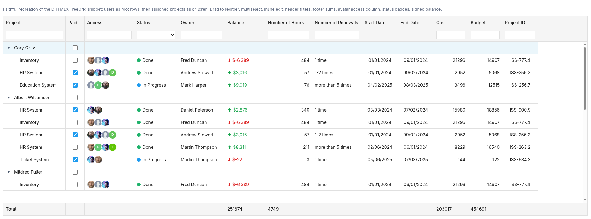

# react-tree-grid

The best open-source alternative to [DHTMLX TreeGrid](https://dhtmlx.com/docs/products/dhtmlxTreeGrid/) — high-performance **Grid**, **Tree**, and **TreeGrid** components for React 18+, with zero dependencies and a feature-complete API.



> **[Live demo →](https://itsmemyk.github.io/react-tree-grid/?path=/story/components-treegrid--d-htmlx-showcase)**  
> Faithful recreation of the DHTMLX TreeGrid showcase: tree rows, drag-and-drop reorder, multi-select, inline edit, header filters, footer sums, avatar columns, status badges, and signed balance.

---

- Zero runtime dependencies — React is the only peer
- CSS Modules with CSS custom properties (`--react-tree-grid-*`) for theming
- Full TypeScript support
- Tree-shakeable sub-path exports

## Installation

```bash
npm install react-tree-grid
```

## Quick Start

### Grid

```tsx
import { Grid } from 'react-tree-grid/grid'
import { ThemeProvider } from 'react-tree-grid'

const columns = [
  { id: 'name', header: [{ text: 'Name' }], width: 180 },
  { id: 'email', header: [{ text: 'Email' }], width: 240 },
]

const data = [
  { id: '1', name: 'Alice', email: 'alice@example.com' },
  { id: '2', name: 'Bob', email: 'bob@example.com' },
]

function App() {
  return (
    <ThemeProvider theme="light">
      <Grid columns={columns} data={data} style={{ width: 480, height: 300 }} />
    </ThemeProvider>
  )
}
```

### Tree

```tsx
import { Tree } from 'react-tree-grid/tree'
import { ThemeProvider } from 'react-tree-grid'
import type { TreeNode } from 'react-tree-grid/tree'

const data: TreeNode[] = [
  {
    id: 'root',
    value: 'Documents',
    $opened: true,
    items: [
      { id: 'file1', value: 'Report.pdf' },
      { id: 'file2', value: 'Notes.txt' },
    ],
  },
]

function App() {
  return (
    <ThemeProvider>
      <Tree data={data} checkbox onCheck={(ids) => console.log(ids)} />
    </ThemeProvider>
  )
}
```

### TreeGrid

```tsx
import { TreeGrid } from 'react-tree-grid/treegrid'
import { ThemeProvider } from 'react-tree-grid'
import type { TreeGridRow } from 'react-tree-grid/treegrid'

interface OrgRow extends TreeGridRow {
  name: string
  role: string
}

const columns = [
  { id: 'name', header: [{ text: 'Name' }], width: 200 },
  { id: 'role', header: [{ text: 'Role' }], width: 160 },
]

const data: OrgRow[] = [
  { id: 'ceo', name: 'Alice', role: 'CEO', $opened: true },
  { id: 'cto', name: 'Bob', role: 'CTO', parent: 'ceo' },
]

function App() {
  return (
    <ThemeProvider>
      <TreeGrid
        columns={columns}
        data={data}
        treeColumnId="name"
        style={{ width: 480, height: 300 }}
      />
    </ThemeProvider>
  )
}
```

## Imports

The library supports both a single entry point and sub-path imports:

```ts
// All components from one import
import { Grid, Tree, TreeGrid, ThemeProvider } from 'react-tree-grid'

// Tree-shakeable sub-path imports
import { Grid } from 'react-tree-grid/grid'
import { Tree } from 'react-tree-grid/tree'
import { TreeGrid } from 'react-tree-grid/treegrid'
```

## ThemeProvider

Wrap your app (or a subtree) with `ThemeProvider` to apply a theme:

```tsx
import { ThemeProvider } from 'react-tree-grid'

<ThemeProvider theme="dark">
  {/* components here */}
</ThemeProvider>
```

### Theme overrides

Pass `overrides` to customise individual tokens:

```tsx
<ThemeProvider
  theme="light"
  overrides={{ colorPrimary: '#e91e63', fontFamily: 'Inter, sans-serif' }}
>
  {/* ... */}
</ThemeProvider>
```

### CSS custom properties

All theme values are exposed as CSS custom properties prefixed with `--react-tree-grid-`:

```css
.my-element {
  color: var(--react-tree-grid-color-primary);
  font-size: var(--react-tree-grid-font-size-md);
  padding: var(--react-tree-grid-spacing-md);
}
```

## Grid Props

| Prop | Type | Description |
|---|---|---|
| `columns` | `GridColumn[]` | Column definitions |
| `data` | `GridRow[]` | Row data |
| `sortable` | `boolean` | Enable column sort |
| `selection` | `boolean \| 'row' \| 'cell' \| 'complex'` | Selection mode |
| `multiselection` | `boolean` | Allow multi-select |
| `editable` | `boolean` | Enable inline editing |
| `leftSplit` | `number` | Freeze N left columns |
| `rightSplit` | `number` | Freeze N right columns |
| `tooltip` | `boolean` | Enable cell tooltips (default `false`) |
| `keyNavigation` | `boolean` | Keyboard navigation |
| `style` | `CSSProperties` | Width/height for virtual scroll |

## Tree Props

| Prop | Type | Description |
|---|---|---|
| `data` | `TreeNode[]` | Tree data |
| `checkbox` | `boolean` | Show checkboxes |
| `editable` | `boolean` | Enable inline label editing |
| `dragItem` | `'item' \| 'both'` | Drag-and-drop mode |
| `expanded` | `string[]` | Controlled expanded IDs |
| `selected` | `string[]` | Controlled selected IDs |
| `checked` | `string[]` | Controlled checked IDs |

## TreeGrid Props

Extends `GridProps` with:

| Prop | Type | Description |
|---|---|---|
| `data` | `TreeGridRow[]` | Hierarchical row data |
| `treeColumnId` | `string` | Column that shows the tree toggle |
| `collapsed` | `boolean` | Start all nodes collapsed |
| `groupBy` | `string \| string[]` | Group rows by field(s) |

## License

MIT
