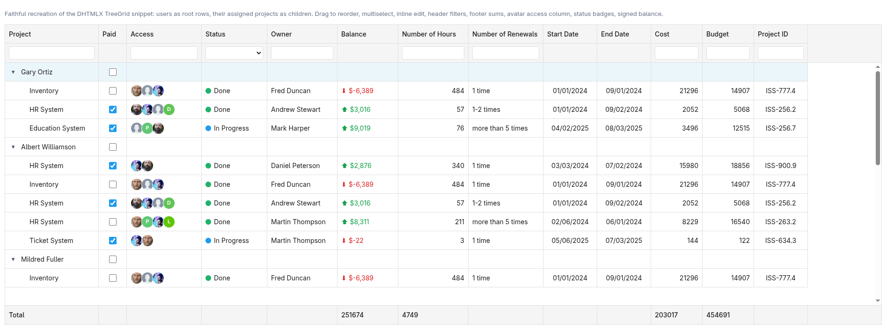

# react-tree-grid

The best open-source alternative to [DHTMLX TreeGrid](https://dhtmlx.com/docs/products/dhtmlxTreeGrid/) — high-performance **Grid**, **Tree**, and **TreeGrid** components for React 18+, with zero dependencies and a feature-complete API.

[](https://www.npmjs.com/package/@itsmemyk/react-tree-grid)
[](https://www.typescriptlang.org/)
[](LICENSE)



> **[Documentation →](https://itsmemyk.github.io/react-tree-grid/docs/)**  
> Guides, API reference, and examples.

> **[Live demo →](https://itsmemyk.github.io/react-tree-grid/?path=/story/tree-grid--d-htmlx-showcase)**  
> Full-featured showcase: tree rows, drag-and-drop reorder, multi-select, inline edit, header filters, footer sums, avatar columns, status badges, and signed balance.

---

- Zero runtime dependencies — React is the only peer
- Full TypeScript support with generics
- Tree-shakeable sub-path exports
- Virtual scrolling for large datasets
- Light and dark themes via `ThemeProvider`
- CSS custom properties (`--react-tree-grid-*`) for token-level theming
- Frozen rows and columns (left, right, top, bottom splits)
- Multi-level column headers and footer aggregates (`sum`, `avg`, `count`, `min`, `max`)
- Inline cell editing with built-in editor types (`input`, `select`, `combo`, `datePicker`, `multiselect`)
- Row and column drag-and-drop reorder
- Column sort, resize, and drag-panel grouping
- Row grouping with aggregates for TreeGrid
- Multi-select with keyboard navigation
- Header filters (`inputFilter`, `selectFilter`, `comboFilter`)
- Cell tooltips and custom cell renderers via `template`

## Table of Contents

- [Installation](#installation)
- [Quick Start](#quick-start)
  - [Grid](#grid)
  - [Tree](#tree)
  - [TreeGrid](#treegrid)
- [Imports](#imports)
- [ThemeProvider](#themeprovider)
  - [ThemeProvider Props](#themeprovider-props)
  - [Theme overrides](#theme-overrides)
  - [CSS custom properties](#css-custom-properties)
- [Grid Props](#grid-props)
  - [Grid Callbacks](#grid-callbacks)
- [GridColumn](#gridcolumn)
  - [GridHeaderCell](#gridheadercell)
  - [GridFooterCell](#gridfootercell)
- [Tree Props](#tree-props)
  - [Tree Callbacks](#tree-callbacks)
- [TreeGrid Props](#treegrid-props)
  - [TreeGrid Callbacks](#treegrid-callbacks)
- [Types](#types)
  - [GridRow](#gridrow)
  - [TreeGridRow](#treegridrow)
  - [TreeNode](#treenode)
  - [GroupAggregateConfig](#groupaggregateconfig)
  - [SortState](#sortstate)
- [License](#license)

## Installation

```bash
# npm
npm install @itsmemyk/react-tree-grid

# pnpm
pnpm add @itsmemyk/react-tree-grid

# yarn
yarn add @itsmemyk/react-tree-grid

# bun
bun add @itsmemyk/react-tree-grid
```

## Quick Start

### Grid

```tsx
import { Grid } from 'react-tree-grid/grid'
import { ThemeProvider } from 'react-tree-grid'

const columns = [
  { id: 'name', header: [{ text: 'Name' }], width: 180 },
  { id: 'email', header: [{ text: 'Email' }], width: 240 },
]

const data = [
  { id: '1', name: 'Alice', email: 'alice@example.com' },
  { id: '2', name: 'Bob', email: 'bob@example.com' },
]

function App() {
  return (
    <ThemeProvider theme="light">
      <Grid columns={columns} data={data} style={{ width: 480, height: 300 }} />
    </ThemeProvider>
  )
}
```

### Tree

```tsx
import { Tree } from 'react-tree-grid/tree'
import { ThemeProvider } from 'react-tree-grid'
import type { TreeNode } from 'react-tree-grid/tree'

const data: TreeNode[] = [
  {
    id: 'root',
    value: 'Documents',
    $opened: true,
    items: [
      { id: 'file1', value: 'Report.pdf' },
      { id: 'file2', value: 'Notes.txt' },
    ],
  },
]

function App() {
  return (
    <ThemeProvider>
      <Tree data={data} checkbox onCheck={(ids) => console.log(ids)} />
    </ThemeProvider>
  )
}
```

### TreeGrid

```tsx
import { TreeGrid } from 'react-tree-grid/treegrid'
import { ThemeProvider } from 'react-tree-grid'
import type { TreeGridRow } from 'react-tree-grid/treegrid'

interface OrgRow extends TreeGridRow {
  name: string
  role: string
}

const columns = [
  { id: 'name', header: [{ text: 'Name' }], width: 200 },
  { id: 'role', header: [{ text: 'Role' }], width: 160 },
]

const data: OrgRow[] = [
  { id: 'ceo', name: 'Alice', role: 'CEO', $opened: true },
  { id: 'cto', name: 'Bob', role: 'CTO', parent: 'ceo' },
]

function App() {
  return (
    <ThemeProvider>
      <TreeGrid
        columns={columns}
        data={data}
        treeColumnId="name"
        style={{ width: 480, height: 300 }}
      />
    </ThemeProvider>
  )
}
```

## Imports

The library supports both a single entry point and sub-path imports:

```ts
// All components from one import
import { Grid, Tree, TreeGrid, ThemeProvider } from 'react-tree-grid'

// Tree-shakeable sub-path imports
import { Grid } from 'react-tree-grid/grid'
import { Tree } from 'react-tree-grid/tree'
import { TreeGrid } from 'react-tree-grid/treegrid'
```

## ThemeProvider

Wrap your app (or a subtree) with `ThemeProvider` to apply a theme:

```tsx
import { ThemeProvider } from 'react-tree-grid'

<ThemeProvider theme="dark">
  {/* components here */}
</ThemeProvider>
```

### ThemeProvider Props

| Prop | Type | Default | Description |
|---|---|---|---|
| `theme` | `'light' \| 'dark'` | `'light'` | Built-in theme to apply |
| `overrides` | `Partial<ThemeTokens>` | — | Override individual design tokens |
| `children` | `ReactNode` | — | Content to render inside the theme |

### Theme overrides

Pass `overrides` to customise individual tokens:

```tsx
<ThemeProvider
  theme="light"
  overrides={{ colorPrimary: '#e91e63', fontFamily: 'Inter, sans-serif' }}
>
  {/* ... */}
</ThemeProvider>
```

### CSS custom properties

All theme values are exposed as CSS custom properties prefixed with `--react-tree-grid-`:

```css
.my-element {
  color: var(--react-tree-grid-color-primary);
  font-size: var(--react-tree-grid-font-size-md);
  padding: var(--react-tree-grid-spacing-md);
}
```

## Grid Props

| Prop | Type | Default | Description |
|---|---|---|---|
| `columns` | `GridColumn[]` | — | Column definitions |
| `data` | `GridRow[]` | — | Row data |
| `rowHeight` | `number` | — | Row height in pixels |
| `headerRowHeight` | `number` | — | Header row height in pixels |
| `footerRowHeight` | `number` | — | Footer row height in pixels |
| `sortable` | `boolean` | `false` | Enable column sort |
| `selection` | `boolean \| 'row' \| 'cell' \| 'complex'` | — | Selection mode |
| `multiselection` | `boolean` | `false` | Allow multi-select |
| `editable` | `boolean` | `false` | Enable inline editing |
| `keyNavigation` | `boolean` | `false` | Keyboard navigation |
| `tooltip` | `boolean` | `false` | Enable cell tooltips |
| `leftSplit` | `number` | — | Freeze N left columns |
| `rightSplit` | `number` | — | Freeze N right columns |
| `topSplit` | `number` | — | Freeze N top rows |
| `bottomSplit` | `number` | — | Freeze N bottom rows |
| `dragItem` | `'item' \| 'both'` | — | Enable row drag-and-drop |
| `adjust` | `boolean \| 'data' \| 'header' \| 'footer'` | — | Auto-fit column widths |
| `autoHeight` | `boolean` | `false` | Grow grid height to fit all rows |
| `groupable` | `boolean` | `false` | Enable drag-panel grouping UI |
| `group` | `{ order: string[] }` | — | Initial grouping column order |
| `style` | `CSSProperties` | — | Width/height (required for virtual scroll) |
| `className` | `string` | — | Root element class name |

### Grid Callbacks

Callbacks whose name starts with `onBefore` can return `false` to cancel the action.

| Callback | Signature | Description |
|---|---|---|
| `onScroll` | `(state: { x: number; y: number }) => void` | Fires on scroll |
| `onBeforeSort` | `(states: SortState[]) => boolean \| void` | Return `false` to cancel sort |
| `onAfterSort` | `(states: SortState[]) => void` | Fires after sort is applied |
| `onBeforeSelect` | `(rowId: string, colId: string) => boolean \| void` | Return `false` to cancel selection |
| `onAfterSelect` | `(rowId: string, colId: string) => void` | Fires after a cell is selected |
| `onBeforeUnSelect` | `(rowId: string, colId: string) => boolean \| void` | Return `false` to cancel deselection |
| `onAfterUnSelect` | `(rowId: string, colId: string) => void` | Fires after a cell is deselected |
| `onCellClick` | `(rowId: string, colId: string, event: MouseEvent) => void` | Fires on cell click |
| `onCellDblClick` | `(rowId: string, colId: string, event: MouseEvent) => void` | Fires on cell double-click |
| `onBeforeEditStart` | `(rowId: string, colId: string) => boolean \| void` | Return `false` to prevent editing |
| `onAfterEditStart` | `(rowId: string, colId: string) => void` | Fires when an editor opens |
| `onBeforeEditEnd` | `(rowId: string, colId: string, newValue: unknown, oldValue: unknown) => boolean \| void` | Return `false` to discard the new value |
| `onAfterEditEnd` | `(rowId: string, colId: string, newValue: unknown) => void` | Fires after a value is saved |
| `onBeforeRowDrop` | `(data: GridRowDragData, event: PointerEvent) => boolean \| void` | Return `false` to cancel drop |
| `onAfterRowDrop` | `(data: GridRowDragData, event: PointerEvent) => void` | Fires after a row is reordered |
| `onBeforeColumnDrop` | `(data: GridColumnDragData, event: DragEvent) => boolean \| void` | Return `false` to cancel column reorder |
| `onAfterColumnDrop` | `(data: GridColumnDragData, event: DragEvent) => void` | Fires after a column is reordered |
| `onResize` | `(colId: string, width: number) => void` | Fires while a column is being resized |
| `onAfterResizeEnd` | `(colId: string, width: number) => void` | Fires after column resize ends |
| `onBeforeGroupChange` | `(order: string[]) => boolean \| void` | Return `false` to cancel grouping change |
| `onGroupChange` | `(order: string[]) => void` | Fires after grouping order changes |

## GridColumn

| Prop | Type | Description |
|---|---|---|
| `id` | `string` | Unique column identifier |
| `header` | `GridHeaderCell[]` | Header cell configuration (supports multi-row headers) |
| `footer` | `GridFooterCell[]` | Footer cell configuration |
| `width` | `number` | Column width in pixels |
| `minWidth` | `number` | Minimum width when resizing |
| `maxWidth` | `number` | Maximum width when resizing |
| `hidden` | `boolean` | Hide the column |
| `sortable` | `boolean` | Override grid-level `sortable` for this column |
| `resizable` | `boolean` | Allow the user to resize this column |
| `type` | `'string' \| 'number' \| 'date' \| 'boolean' \| 'checkbox'` | Column data type |
| `editorType` | `'input' \| 'select' \| 'combo' \| 'checkbox' \| 'datePicker' \| 'multiselect'` | Editor shown when the cell is in edit mode |
| `align` | `'left' \| 'center' \| 'right'` | Cell content alignment |
| `template` | `(value, row, column) => ReactNode` | Custom cell renderer |
| `tooltipTemplate` | `(value, row, column) => string` | Custom tooltip content |
| `tooltip` | `boolean` | Enable tooltip for this column |
| `groupable` | `boolean` | Allow this column to be used in the grouping panel |
| `mark` | `GridMarkConfig` | Conditional cell styling rules |
| `adjust` | `'header' \| 'data' \| 'all'` | Auto-fit width for this column |
| `autoWidth` | `boolean` | Stretch column to fill remaining space |

### GridHeaderCell

```ts
interface GridHeaderCell {
  text?: string
  colspan?: number
  rowspan?: number
  content?: 'inputFilter' | 'selectFilter' | 'comboFilter'
  css?: string
}
```

### GridFooterCell

```ts
interface GridFooterCell {
  text?: string
  colspan?: number
  content?: 'sum' | 'avg' | 'count' | 'min' | 'max'
  css?: string
}
```

## Tree Props

| Prop | Type | Default | Description |
|---|---|---|---|
| `data` | `TreeNode[]` | — | Tree data |
| `checkbox` | `boolean` | `false` | Show checkboxes |
| `editable` | `boolean` | `false` | Enable inline label editing |
| `dragItem` | `'item' \| 'both'` | — | Drag-and-drop mode |
| `expanded` | `string[]` | — | Controlled expanded node IDs |
| `defaultExpanded` | `string[]` | — | Initially expanded node IDs (uncontrolled) |
| `selected` | `string[]` | — | Controlled selected node IDs |
| `checked` | `string[]` | — | Controlled checked node IDs |

### Tree Callbacks

| Callback | Signature | Description |
|---|---|---|
| `onSelect` | `(id: string) => void` | Fires when a node is selected |
| `onCheck` | `(ids: string[]) => void` | Fires when checkbox state changes; receives all checked IDs |
| `onExpand` | `(id: string) => void` | Fires when a node is expanded |
| `onCollapse` | `(id: string) => void` | Fires when a node is collapsed |
| `onEdit` | `(id: string, newValue: string) => void` | Fires after an inline label edit |
| `onDrop` | `(dragId: string, targetId: string, position: 'before' \| 'after' \| 'inside') => void` | Fires after a drag-and-drop reorder |

## TreeGrid Props

Extends all [Grid Props](#grid-props) and adds:

| Prop | Type | Default | Description |
|---|---|---|---|
| `data` | `TreeGridRow[]` | — | Hierarchical row data |
| `treeColumnId` | `string` | — | Column that renders the expand/collapse toggle |
| `collapsed` | `boolean` | `false` | Start all nodes collapsed |
| `groupBy` | `string \| string[]` | — | Group rows by one or more fields |
| `groupAggregate` | `GroupAggregateConfig` | — | Aggregate values on group header rows |
| `dropBehaviour` | `'child' \| 'sibling' \| 'complex'` | `'complex'` | How a dropped row is placed in the tree |
| `dragExpand` | `boolean` | `false` | Auto-expand a node when a row is dragged over it |

### TreeGrid Callbacks

TreeGrid inherits all [Grid Callbacks](#grid-callbacks). Row drop events carry additional context describing the tree position (parent, index) of the dropped row.

## Types

### GridRow

```ts
interface GridRow {
  id: string
  hidden?: boolean    // Hide the row without removing it from data
  $height?: number    // Per-row height override in pixels
  $css?: string       // Row-level CSS class name
  [key: string]: unknown
}
```

### TreeGridRow

```ts
interface TreeGridRow extends GridRow {
  parent?: string        // ID of the parent row (flat data format)
  items?: TreeGridRow[]  // Inline nested children (nested data format)
  $opened?: boolean      // Start the node expanded
}
```

### TreeNode

```ts
interface TreeNode {
  id: string
  value: string
  icon?: ReactNode
  items?: TreeNode[]
  disabled?: boolean
  $opened?: boolean  // Start the node expanded
}
```

### GroupAggregateConfig

```ts
type GroupAggregateConfig = Record<string, 'sum' | 'avg' | 'count' | 'min' | 'max'>
```

```tsx
// Sum the 'salary' column, count rows in 'department'
<TreeGrid
  groupBy="department"
  groupAggregate={{ salary: 'sum', department: 'count' }}
  ...
/>
```

### SortState

```ts
interface SortState {
  columnId: string
  order: 'asc' | 'desc'
}
```

## License

MIT
